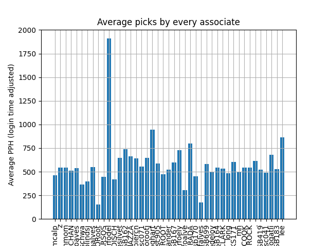
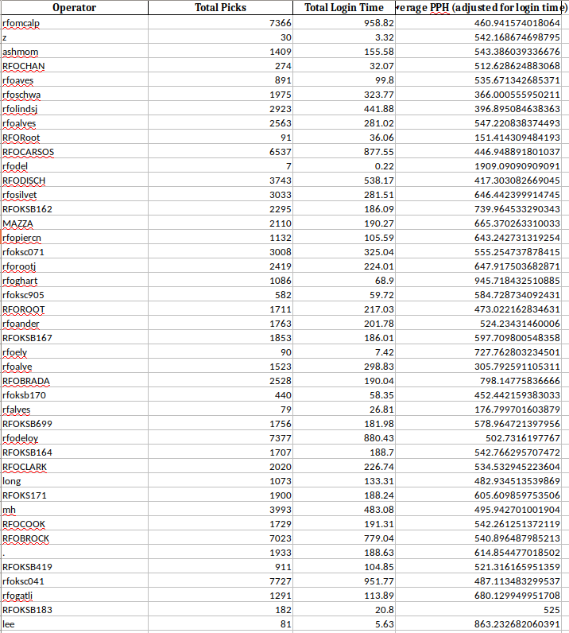

# AveragePickerPicks

This program calcualates the average picks per hour for every picker taking into account the time they logged in to every system. 

Please run the csv_stitcher.py to stitch all the raw files in csv_files directory. This creates a massive file called the csv_combined.csv. This is basically all data from all days combined into one. 

Now run, avg_time.py

Average PPH for an operator (with data from Kibana) 

[Link to get the raw data](https://sunflower.kb.us-central1.gcp.cloud.es.io:9243/app/discover#/?_g=(filters:!(),refreshInterval:(pause:!t,value:0),time:(from:now-6h,to:now))&_a=(columns:!(system_name,message,operator_id),filters:!(),index:ce572630-0f58-11ed-bd81-e7f3585b181b,interval:auto,query:(language:kuery,query:'(%22user_logout%22%20or%20%22user_login%22%20or%20(%22OB1-Interface%22%20and%20%22PICKCOMPLETE%22))%20'),sort:!(!('@timestamp',desc))))

## Outputs - Graph and Table

 

 

